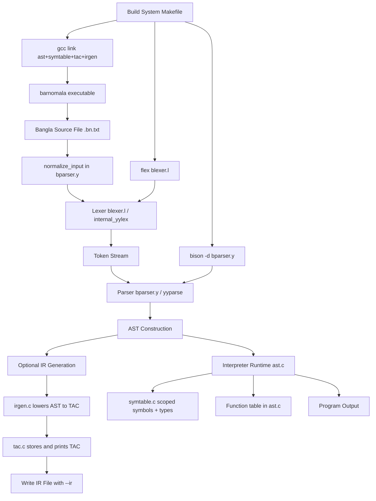

# Barnomala Compiler Working Flow Diagram

## Runtime flow summary
1. Input is normalized for specific Bengali Unicode cases.
2. Lexer tokenizes Bangla syntax and indentation into parser tokens.
3. Parser validates grammar and builds AST.
4. If --ir is enabled, AST is lowered into TAC and written to file.
5. AST is interpreted directly for program execution.
